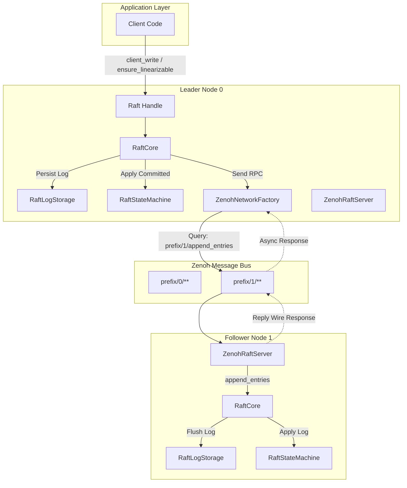

[English](#en) | [中文](#zh)

---

<a id="en"></a>
# zenoh_raft : Distributed Raft Consensus Engine Powered by Zenoh Transport

High-performance, async distributed consensus engine built on Rust Edition 2024, combining the Raft consensus protocol with [Zenoh](https://zenoh.io/) peer-to-peer and routed communication middleware.

## Project Overview

zenoh_raft delivers robust consensus capabilities with minimal communication overhead. By leveraging Zenoh queryable endpoints and key-expression routing, nodes discover peers and exchange Raft RPCs without dedicated network infrastructure or manual socket lifecycle management.

Key capabilities include:

- Distributed state machine replication with leader election and log management.
- Native Zenoh transport integration for RPC routing over QUIC, TCP, or TLS.
- Linearizable reads supporting both ReadIndex and LeaseRead policies.
- Dynamic cluster membership reconfiguration using joint consensus.
- Pipeline log streaming and batched I/O execution.

## Key Features

- **Native Zenoh Transport**: Direct mapping of Raft RPCs (AppendEntries, RequestVote, InstallSnapshot, TransferLeader) to Zenoh query expressions, providing zero-configuration routing across edge, cloud, and mesh networks.
- **Efficient Binary Serialization**: Optimized wire format using `bitcode` encoding for low serialization latency and minimal network footprint.
- **Linearizable Consistency**: Strict data safety through Raft commit invariants, quorum lease validation, and state machine version tracking.
- **Joint Consensus Membership Changes**: Two-phase membership transition allowing safe cluster scaling without disruption.
- **Pluggable Storage Abstractions**: Modular separation between log storage (`RaftLogStorage`) and state machine execution (`RaftStateMachine`).
- **Asynchronous Execution Architecture**: Non-blocking concurrency runtime powered by asynchronous channels and decoupled worker routines.

## Usage

The following example demonstrates creating a 3-node cluster over Zenoh transport, initializing membership, writing data via leader, and executing linearizable reads:

```rust
use std::sync::Arc;
use std::time::Duration;
use maplit::btreeset;
use zenoh::query::QueryTarget;
use zenoh_raft::{
  Config, Raft, ReadPolicy, ServerState,
  ZenohNetworkConfig, ZenohNetworkFactory, ZenohRaftServer,
  testing::memstore::{ClientRequest, IntoMemClientRequest, TypeConfig, new_mem_store},
};

#[compio::main]
async fn main() -> Result<(), Box<dyn std::error::Error>> {
  let key_prefix = "demo_raft_cluster";

  // 1. Initialize Zenoh session
  let session = Arc::new(zenoh::open(zenoh::Config::default()).await?);

  // 2. Configure Raft parameters
  let raft_config = Arc::new(
    Config {
      enable_heartbeat: true,
      heartbeat_interval: 100,
      election_timeout_min: 500,
      election_timeout_max: 600,
      ..Default::default()
    }
    .validate()?,
  );

  let net_config = ZenohNetworkConfig {
    key_prefix: key_prefix.to_string(),
    default_timeout: Duration::from_secs(3),
    query_target: QueryTarget::BestMatching,
  };

  // 3. Create 3 Raft nodes with in-memory store and Zenoh network factory
  let (sto0, sm0) = new_mem_store();
  let net0 = ZenohNetworkFactory::<TypeConfig>::new(session.clone(), net_config.clone());
  let raft0 = Raft::new(0, raft_config.clone(), net0, sto0, sm0.clone()).await?;

  let (sto1, sm1) = new_mem_store();
  let net1 = ZenohNetworkFactory::<TypeConfig>::new(session.clone(), net_config.clone());
  let raft1 = Raft::new(1, raft_config.clone(), net1, sto1, sm1.clone()).await?;

  let (sto2, sm2) = new_mem_store();
  let net2 = ZenohNetworkFactory::<TypeConfig>::new(session.clone(), net_config.clone());
  let raft2 = Raft::new(2, raft_config.clone(), net2, sto2, sm2.clone()).await?;

  // 4. Start Zenoh RPC queryable servers on each node
  let _srv0 = ZenohRaftServer::start(&session, raft0.clone(), key_prefix, 0).await?;
  let _srv1 = ZenohRaftServer::start(&session, raft1.clone(), key_prefix, 1).await?;
  let _srv2 = ZenohRaftServer::start(&session, raft2.clone(), key_prefix, 2).await?;

  // 5. Initialize cluster from node 0 and form 3-node membership
  raft0.initialize(btreeset! {0}).await?;
  raft0
    .wait(Some(Duration::from_secs(5)))
    .state(ServerState::Leader, "node 0 becomes leader")
    .await?;

  raft0.add_learner(1, (), true).await?;
  raft0.add_learner(2, (), true).await?;
  raft0.change_membership(btreeset! {0, 1, 2}, false).await?;

  // 6. Execute client writes through the leader
  let write_resp = raft0
    .client_write(ClientRequest::make_request("account_1", 100))
    .await?;
  println!("Log index applied: {:?}", write_resp.log_id);

  // 7. Perform linearizable read validation
  raft0.ensure_linearizable(ReadPolicy::ReadIndex).await?;
  let sm_state = sm0.get_state_machine().await;
  println!("Applied client state: {:?}", sm_state.client_status.get("account_1"));

  Ok(())
}
```

## Design & Architecture

zenoh_raft decouples consensus logic, state persistence, and network transport into clear layers:

- **Raft Handle (`Raft<C, SM>`)**: Lightweight, cheaply cloneable frontend handle exposing client operations, administrative triggers, metrics channels, and protocol handlers.
- **Raft Core (`RaftCore`)**: Singleton state machine actor executing the Raft protocol loop, election timers, quorum calculations, and replication progress trackers.
- **Storage Subsystem**: Split into `RaftLogStorage` (persisting votes and append logs) and `RaftStateMachine` (applying committed entries and managing snapshots).
- **Zenoh Transport Layer**: Translates outgoing RPCs into Zenoh `get()` queries and incoming queries into Raft method executions via `ZenohRaftServer`.



## Tech Stack

- **Rust Edition 2024**: Modern Rust language standard with strict safety and zero-cost abstractions.
- **Zenoh 1.10**: Universal publish/subscribe, queryable, and routing middleware.
- **Bitcode**: Zero-overhead binary encoding for wire format structures.
- **Compio & Crossfire**: Asynchronous I/O execution, timers, and lock-free channels.
- **Rapidhash**: High-speed hashing implementation for internal map lookups.
- **Jiff & Coarsetime**: High-resolution and low-overhead timestamp tracking.

## Directory Structure

```
raft/
├── Cargo.toml                  # Package manifest and dependency configuration
├── README.mdt                  # Documentation template
├── readme/                     # Bilingual documentation sources
│   ├── en.md                   # English documentation
│   └── zh.md                   # Chinese documentation
├── src/                        # Core library source code
│   ├── async_runtime/          # Async runtime abstraction, deterministic RNG, watch channels
│   ├── base/                   # Base trait bounds, features, and ID generator
│   ├── batch/                  # Batch abstraction and inline batch buffers
│   ├── change_members.rs       # Cluster membership modification commands
│   ├── config/                 # Raft configuration, runtime adjustments, validation rules
│   ├── core/                   # RaftCore state loop, heartbeat worker, linearizable read queue
│   ├── display_ext/            # Formatting and string representation extensions
│   ├── engine/                 # Pure consensus state transition engine
│   ├── entry/                  # Log entry representations and payload abstractions
│   ├── errors/                 # Error types for RPC, storage, replication, and client APIs
│   ├── extensions/             # Extensible typed context map for Raft instances
│   ├── impls/                  # Default trait implementations (Node, LeaderId, Responders)
│   ├── log_id.rs               # Raft LogId structure and comparison traits
│   ├── log_id_range.rs         # Bounded LogId ranges for batch replication
│   ├── membership/             # Joint consensus membership calculations and storage
│   ├── metrics/                # Node state metrics, data metrics, and condition waiters
│   ├── network/                # Raft network traits, Zenoh network factory, and Zenoh server
│   ├── node/                   # Node ID and Node address definitions
│   ├── progress/               # Follower replication progress tracking
│   ├── proposer/               # Leader proposal management
│   ├── quorum/                 # Majority quorum and joint quorum calculation
│   ├── raft/                   # Main Raft handle, AppApi, ManagementApi, ProtocolApi
│   ├── raft_state/             # Internal Raft state tracking and membership state
│   ├── raft_types/             # Term, Index, and Snapshot ID type aliases
│   ├── replication/            # Background replication worker loops
│   ├── runtime/                # Runtime execution hooks
│   ├── storage/                # RaftLogStorage, RaftStateMachine, and snapshot builder traits
│   ├── summary/                # Message summary formatting traits
│   ├── testing/                # In-memory test store, mock fixtures, and utilities
│   ├── try_as_ref/             # Reference extraction helper traits
│   ├── type_config/            # RaftTypeConfig trait and type definitions
│   ├── utime/                  # Timestamp and elapsed duration tracking
│   ├── vote/                   # Vote and LeaderId state structures
│   └── lib.rs                  # Crate root and public export surface
└── tests/                      # Integration and scenario test suite
    ├── append_entries_test.rs  # Log append and conflict handling tests
    ├── client_api_test.rs      # Client write and read API tests
    ├── elect_test.rs           # Leader election tests
    ├── fixtures/               # Test harness fixtures and RPC mocks
    ├── zenoh_cluster_test.rs   # Distributed 3-node Zenoh integration test
    └── zenoh_test.rs           # Zenoh session connectivity and queryable test
```

## API Reference

### Core Types & Handles

- `Raft<C, SM>`: Primary handle to interact with a Raft node. Cheaply cloneable. Key methods:
  - `new(id, config, network, log_store, state_machine)`: Constructs and spawns a Raft node instance.
  - `initialize(members)`: Bootstraps initial cluster membership on a pristine node.
  - `client_write(app_data)`: Submits a state mutation command through the leader.
  - `client_write_many(app_data)`: Streams multiple mutation commands in a single batch.
  - `write(app_data)`: Returns a builder for flexible write dispatch (fire-and-forget or custom responder).
  - `ensure_linearizable(policy)`: Verifies leadership and returns the required read log boundary for linearizable reads.
  - `get_read_linearizer(policy)`: Returns a `Linearizer` for fine-grained read synchronization.
  - `add_learner(id, node, blocking)`: Adds a learner node and establishes log replication.
  - `change_membership(members, retain)`: Proposes a dynamic membership change via joint consensus.
  - `vote(rpc)` / `pre_vote(rpc)`: Handles vote requests from candidate nodes.
  - `append_entries(rpc)` / `stream_append(stream)`: Processes log replication requests.
  - `install_full_snapshot(vote, snapshot)`: Applies a complete snapshot to the state machine.
  - `handle_transfer_leader(req)`: Executes graceful leadership transfer.
  - `shutdown()`: Triggers graceful node termination.
  - `metrics()` / `data_metrics()` / `server_metrics()`: Obtains watch receivers for real-time node metrics.
  - `wait(timeout)`: Creates a waiter for metrics condition assertions.
  - `trigger()`: Provides administrative hooks (manual election, snapshot builds, log purges).
  - `runtime_config()`: Dynamically toggles election, heartbeat, and tick execution.
  - `as_leader()`: Validates whether the local node is currently the active leader.
  - `is_leader()`: Fast boolean check of current leadership status.
  - `node_id()` / `voter_ids()` / `learner_ids()`: Queries node identification and membership sets.
  - `with_raft_state(func)` / `with_state_machine(func)`: Safely inspects internal state within execution contexts.

### Zenoh Network Integration

- `ZenohNetworkConfig`: Network configuration options:
  - `key_prefix`: Base Zenoh key expression prefix (default: `"zenoh_raft"`).
  - `default_timeout`: RPC request timeout duration.
  - `query_target`: Zenoh query routing strategy (`QueryTarget::BestMatching`).
- `ZenohNetworkFactory<C>`: Factory implementing `RaftNetworkFactory<C>` using a shared `zenoh::Session`.
- `ZenohNetwork<C>`: Network client instance handling RPC dispatches to a specific target node over Zenoh queries.
- `ZenohRaftServer`: Queryable listener registering key expressions (`<key_prefix>/<node_id>/**`) and dispatching incoming requests directly into the local Raft node.

### Configuration & Protocols

- `Config`: Raft protocol parameters (election timeouts, heartbeat intervals, batch sizes, snapshot policies, replication lag thresholds).
- `ServerState`: Node operational state (`Leader`, `Follower`, `Candidate`, `Learner`).
- `ReadPolicy`: Read consistency mode (`ReadIndex` for quorum heartbeat validation, `LeaseRead` for local lease validation).
- `ChangeMembers`: Specification for membership adjustments (`AddNodes`, `RemoveNodes`, `Replace`, `PurgeNodes`).
- `Precondition`: Guard conditions for atomic membership transitions (`LastMembershipLogId`, `CommittedLeaderId`).

### Storage Traits & Data Types

- `RaftLogStorage<C>`: Trait for persistent log storage, log truncation, vote persistence, and committed index recording.
- `RaftStateMachine<C>`: Trait for applying committed log entries, building snapshots, and restoring state from snapshots.
- `RaftLogReader<C>`: Interface for reading log entries and state metadata.
- `RaftSnapshotBuilder<C>`: Interface for generating point-in-time state snapshots.
- `LogId<N>`: Unique log entry identifier containing term and log index.
- `Vote<N>`: Leader election vote state containing term and node identity.
- `Entry<C>` / `EntryPayload<C>`: Log entry container holding normal commands, membership configs, or blank entries.
- `Snapshot<C>` / `SnapshotMeta<C>`: Complete snapshot package with metadata and readable data cursor.

### Type Configuration

- `RaftTypeConfig`: Trait defining associated types for application data (`D`), response (`R`), node ID (`NodeId`), node metadata (`Node`), term (`Term`), leader ID (`LeaderId`), vote (`Vote`), payload (`Payload`), entry (`Entry`), and async responder (`Responder`).
- `declare_raft_types!`: Macro generating concrete implementations of `RaftTypeConfig` with sensible defaults.

---

<a id="zh"></a>
# zenoh_raft : 基于 Zenoh 传输层的高性能分布式 Raft 共识引擎

基于 Rust Edition 2024 构建的异步分布式共识引擎，深度结合 Raft 共识协议与 [Zenoh](https://zenoh.io/) 点对点及路由通信中间件。

## 项目功能介绍

zenoh_raft 提供高吞吐、低延迟的分布式一致性保障。通过 Zenoh 表达力丰富的 Key 表达式路由与 Queryable 查询机制，节点间可直接完成对等发现与 Raft RPC 通信，无需额外部署独立网络代理或手动维护套接字连接生命周期。

核心能力包含：

- 分布式状态机复制、主节点选举与日志生命周期管理。
- 原生集成 Zenoh 传输层，无缝支持 QUIC、TCP、TLS 等多种底层网络协议。
- 线性一致性读保障，提供 ReadIndex 与 LeaseRead 两种一致性读策略。
- 基于联合共识（Joint Consensus）的动态集群成员变更。
- 流式日志复制与异步流水线批处理。

## 特性介绍

- **原生 Zenoh 传输**：将 Raft 核心 RPC（AppendEntries、RequestVote、InstallSnapshot、TransferLeader）直接映射至 Zenoh 键表达式查询，在边缘计算、跨网段及网状拓扑中实现零配置通信。
- **高效二进制编码**：采用 `bitcode` 高性能编解码器序列化传输载荷，大幅降低序列化开销与网络带宽占用。
- **线性一致性保证**：严格遵循 Raft 提交不变式、法定人数租约校验与状态机应用水位跟踪，杜绝脏读。
- **联合共识成员变更**：采用两阶段配置变更方案，支持平滑动态扩缩容，避免集群脑裂。
- **解耦存储抽象**：解耦持久化日志存储接口（`RaftLogStorage`）与状态机接口（`RaftStateMachine`），便于对接 RocksDB、内存存储或自定义持久化引擎。
- **纯异步执行架构**：基于异步通道与独立 Worker 调度，消除阻塞等待，提升并发处理能力。

## 使用演示

以下示例展示创建 3 节点集群、配置 Zenoh 传输、初始化集群拓扑、提交数据写入并执行线性一致性读取的完整流程：

```rust
use std::sync::Arc;
use std::time::Duration;
use maplit::btreeset;
use zenoh::query::QueryTarget;
use zenoh_raft::{
  Config, Raft, ReadPolicy, ServerState,
  ZenohNetworkConfig, ZenohNetworkFactory, ZenohRaftServer,
  testing::memstore::{ClientRequest, IntoMemClientRequest, TypeConfig, new_mem_store},
};

#[compio::main]
async fn main() -> Result<(), Box<dyn std::error::Error>> {
  let key_prefix = "demo_raft_cluster";

  // 1. 创建 Zenoh 会话
  let session = Arc::new(zenoh::open(zenoh::Config::default()).await?);

  // 2. 配置 Raft 参数
  let raft_config = Arc::new(
    Config {
      enable_heartbeat: true,
      heartbeat_interval: 100,
      election_timeout_min: 500,
      election_timeout_max: 600,
      ..Default::default()
    }
    .validate()?,
  );

  let net_config = ZenohNetworkConfig {
    key_prefix: key_prefix.to_string(),
    default_timeout: Duration::from_secs(3),
    query_target: QueryTarget::BestMatching,
  };

  // 3. 创建 3 节点内存存储与 Zenoh 网络工厂
  let (sto0, sm0) = new_mem_store();
  let net0 = ZenohNetworkFactory::<TypeConfig>::new(session.clone(), net_config.clone());
  let raft0 = Raft::new(0, raft_config.clone(), net0, sto0, sm0.clone()).await?;

  let (sto1, sm1) = new_mem_store();
  let net1 = ZenohNetworkFactory::<TypeConfig>::new(session.clone(), net_config.clone());
  let raft1 = Raft::new(1, raft_config.clone(), net1, sto1, sm1.clone()).await?;

  let (sto2, sm2) = new_mem_store();
  let net2 = ZenohNetworkFactory::<TypeConfig>::new(session.clone(), net_config.clone());
  let raft2 = Raft::new(2, raft_config.clone(), net2, sto2, sm2.clone()).await?;

  // 4. 在各节点注册 Zenoh Raft RPC Queryable 服务端
  let _srv0 = ZenohRaftServer::start(&session, raft0.clone(), key_prefix, 0).await?;
  let _srv1 = ZenohRaftServer::start(&session, raft1.clone(), key_prefix, 1).await?;
  let _srv2 = ZenohRaftServer::start(&session, raft2.clone(), key_prefix, 2).await?;

  // 5. 初始化单节点并扩展为 3 节点集群
  raft0.initialize(btreeset! {0}).await?;
  raft0
    .wait(Some(Duration::from_secs(5)))
    .state(ServerState::Leader, "node 0 becomes leader")
    .await?;

  raft0.add_learner(1, (), true).await?;
  raft0.add_learner(2, (), true).await?;
  raft0.change_membership(btreeset! {0, 1, 2}, false).await?;

  // 6. 主节点提交客户端写请求
  let write_resp = raft0
    .client_write(ClientRequest::make_request("account_1", 100))
    .await?;
  println!("日志已提交并应用至索引: {:?}", write_resp.log_id);

  // 7. 线性一致性读验证
  raft0.ensure_linearizable(ReadPolicy::ReadIndex).await?;
  let sm_state = sm0.get_state_machine().await;
  println!("状态机客户端数据: {:?}", sm_state.client_status.get("account_1"));

  Ok(())
}
```

## 设计思路

zenoh_raft 将共识算法逻辑、持久化层与网络传输层解耦为清晰模块：

- **Raft 句柄 (`Raft<C, SM>`)**：轻量级、低开销可克隆的前端交互接口，负责向应用层暴露写操作、一致性读、成员管理、状态监控通道与管理触发器。
- **Raft 核心状态机 (`RaftCore`)**：单例核心调度实体，运行 Raft 事件驱动主循环，维护选举计时器、心跳分发、法定人数仲裁及副本复制进度。
- **存储子系统**：严格拆分为 `RaftLogStorage`（负责持久化投票状态与日志追加）与 `RaftStateMachine`（负责顺序应用已提交日志并生成/安装快照）。
- **Zenoh 网络层**：将出站 RPC 封装为 Zenoh `get()` 查询，通过 `ZenohRaftServer` 监听特定键表达式并将入站请求分发给本地 Raft 实例。

```mermaid
graph TD
  subgraph ClientApp["应用层"]
    Client["客户端请求"]
  end

  subgraph LeaderNode["主节点 0"]
    RaftHandle0["Raft 交互句柄"]
    RaftCore0["RaftCore 核心引擎"]
    LogStorage0["RaftLogStorage 日志存储"]
    StateMachine0["RaftStateMachine 状态机"]
    ZenohNet0["ZenohNetworkFactory 网络工厂"]
    ZenohServer0["ZenohRaftServer 查询端"]
  end

  subgraph ZenohBus["Zenoh 通信总线"]
    Key0["prefix/0/**"]
    Key1["prefix/1/**"]
  end

  subgraph FollowerNode["从节点 1"]
    ZenohServer1["ZenohRaftServer 查询端"]
    RaftCore1["RaftCore 核心引擎"]
    LogStorage1["RaftLogStorage 日志存储"]
    StateMachine1["RaftStateMachine 状态机"]
  end

  Client -->|client_write / ensure_linearizable| RaftHandle0
  RaftHandle0 --> RaftCore0
  RaftCore0 -->|追加日志| LogStorage0
  RaftCore0 -->|应用已提交条目| StateMachine0
  RaftCore0 -->|分发副本 RPC| ZenohNet0
  ZenohNet0 -->|查询: prefix/1/append_entries| Key1
  Key1 --> ZenohServer1
  ZenohServer1 -->|append_entries| RaftCore1
  RaftCore1 -->|刷盘持久化| LogStorage1
  RaftCore1 -->|应用日志| StateMachine1
  ZenohServer1 -.->|应答二进制响应| Key1
  Key1 -.->|异步返回结果| ZenohNet0
```



## 技术堆栈

- **Rust Edition 2024**：采用现代 Rust 语法特性与严谨类型系统。
- **Zenoh 1.10**：兼具发布订阅、分布式查询与路由能力的现代通信协议。
- **Bitcode**：高性能紧凑二进制序列化格式。
- **Compio & Crossfire**：高性能异步运行时与高效无锁通道。
- **Rapidhash**：快速哈希表实现。
- **Jiff & Coarsetime**：高精度与低开销时间计算方案。

## 目录结构

```
raft/
├── Cargo.toml                  # 项目依赖与包配置清单
├── README.mdt                  # 文档组合模板文件
├── readme/                     # 双语详细文档目录
│   ├── en.md                   # 英文说明文档
│   └── zh.md                   # 中文说明文档
├── src/                        # 核心源代码目录
│   ├── async_runtime/          # 异步运行时抽象、确定性随机数与 watch 广播通道
│   ├── base/                   # 基础 Trait 约束与 ID 生成器
│   ├── batch/                  # 批处理抽象与内联批处理缓冲区
│   ├── change_members.rs       # 集群拓扑成员变更指令集
│   ├── config/                 # Raft 参数配置、运行时动态调节与配置校验
│   ├── core/                   # RaftCore 状态机循环、心跳管理与线性一致性读队列
│   ├── display_ext/            # 格式化输出与字符串表示扩展
│   ├── engine/                 # 纯函数式共识状态转移引擎
│   ├── entry/                  # 日志条目结构与载荷定义
│   ├── errors/                 # 细粒度错误类型定义（RPC、存储、复制与客户端调用）
│   ├── extensions/             # Raft 实例上下文扩展存储容器
│   ├── impls/                  # 默认 Trait 实现（节点定义、LeaderId、响应通道）
│   ├── log_id.rs               # 日志 LogId 标识与比较逻辑
│   ├── log_id_range.rs         # 范围日志 LogId 区间与批处理划分
│   ├── membership/             # 联合共识成员计算与持久化模型
│   ├── metrics/                # 节点运行指标采集与状态等待器
│   ├── network/                # Raft 网络 Trait、Zenoh 客户端工厂与服务端实现
│   ├── node/                   # 节点 ID 与节点网络元数据定义
│   ├── progress/               # 副本节点日志同步进度跟踪器
│   ├── proposer/               # 提议者状态机与提案管理
│   ├── quorum/                 # 多数派与联合法定人数计算
│   ├── raft/                   # Raft 主句柄、AppApi、ManagementApi、ProtocolApi
│   ├── raft_state/             # 内部状态管理与成员配置快照
│   ├── raft_types/             # 任期 Term、索引 Index 及快照 ID 类型别名
│   ├── replication/            # 后台日志复制 Worker 调度
│   ├── runtime/                # 运行时钩子与执行辅助
│   ├── storage/                # RaftLogStorage、RaftStateMachine 及快照构建 Trait
│   ├── summary/                # 协议消息摘要输出 Trait
│   ├── testing/                # 内存存储测试套件与模拟环境
│   ├── try_as_ref/             # 引用提取辅助 Trait
│   ├── type_config/            # RaftTypeConfig 类型配置定义与关联类型绑定
│   ├── utime/                  # 微秒/纳秒单调时间跟踪
│   ├── vote/                   # 投票状态与 LeaderId 结构体
│   └── lib.rs                  # Crate 根模块与顶层公共导出接口
└── tests/                      # 集成测试与场景验证套件
    ├── append_entries_test.rs  # 日志追加与冲突处理测试
    ├── client_api_test.rs      # 客户端读写 API 测试
    ├── elect_test.rs           # 选主与任期切换测试
    ├── fixtures/               # 测试固件与网络 Mock
    ├── zenoh_cluster_test.rs   # 真实 Zenoh 传输层三节点集群集成测试
    └── zenoh_test.rs           # Zenoh 会话通信与 Queryable 响应测试
```

## API 说明

### 核心类型与句柄

- `Raft<C, SM>`：Raft 节点主交互句柄，支持轻量克隆。主要方法：
  - `new(id, config, network, log_store, state_machine)`：构建并启动 Raft 节点实例。
  - `initialize(members)`：在全新节点上初始化初始集群成员配置。
  - `client_write(app_data)`：通过 Leader 节点提交数据修改请求。
  - `client_write_many(app_data)`：以流式批处理方式提交多条写请求。
  - `write(app_data)`：提供流式写请求构造器，支持自定义响应器与 Leader 条件校验。
  - `ensure_linearizable(policy)`：校验 Leader 身份并返回一致性读取所需日志水位。
  - `get_read_linearizer(policy)`：获取 `Linearizer`，精细化控制读取就绪等待。
  - `add_learner(id, node, blocking)`：向集群添加 Learner 节点并建立副本同步。
  - `change_membership(members, retain)`：提交联合共识成员变更提议。
  - `vote(rpc)` / `pre_vote(rpc)`：处理候选节点发起的拉票与预拉票 RPC。
  - `append_entries(rpc)` / `stream_append(stream)`：处理日志复制与心跳 RPC。
  - `install_full_snapshot(vote, snapshot)`：向状态机安装全量快照。
  - `handle_transfer_leader(req)`：处理优雅 Leader 转移。
  - `shutdown()`：优雅停止 Raft 节点。
  - `metrics()` / `data_metrics()` / `server_metrics()`：订阅节点运行指标 Watch 广播。
  - `wait(timeout)`：创建指标条件等待器。
  - `trigger()`：获取管理触发器（手动发起选举、快照构建、日志清理）。
  - `runtime_config()`：运行时动态调整选举、心跳及时钟轮询开关。
  - `as_leader()`：确认本地是否处于已提交 Leader 状态。
  - `is_leader()`：快速判断当前节点是否为主节点。
  - `node_id()` / `voter_ids()` / `learner_ids()`：获取节点编号与当前成员集合。
  - `with_raft_state(func)` / `with_state_machine(func)`：在安全执行上下文直接访问内部状态。

### Zenoh 网络模块

- `ZenohNetworkConfig`：Zenoh 网络配置结构体：
  - `key_prefix`：Zenoh 键表达式前缀（默认 `"zenoh_raft"`）。
  - `default_timeout`：RPC 请求默认超时时间。
  - `query_target`：查询目标路由策略（`QueryTarget::BestMatching`）。
- `ZenohNetworkFactory<C>`：基于共享 `zenoh::Session` 实现的 `RaftNetworkFactory<C>` 网络工厂。
- `ZenohNetwork<C>`：单节点 RPC 客户端，通过 Zenoh Query 发送 Raft RPC。
- `ZenohRaftServer`：Queryable 服务端监听器，监听 `<key_prefix>/<node_id>/**` 并路由至本地 Raft 实例。

### 配置与协议类型

- `Config`：Raft 核心运行参数（选举超时区间、心跳间隔、批处理上限、快照策略、落后阈值）。
- `ServerState`：节点角色枚举（`Leader`、`Follower`、`Candidate`、`Learner`）。
- `ReadPolicy`：线性一致性读策略（`ReadIndex` 法定人数心跳探测，`LeaseRead` 本地租约判定）。
- `ChangeMembers`：成员变更配置枚举（`AddNodes`、`RemoveNodes`、`Replace`、`PurgeNodes`）。
- `Precondition`：成员变更前置条件约束（`LastMembershipLogId`、`CommittedLeaderId`）。

### 存储接口与数据类型

- `RaftLogStorage<C>`：持久化日志存储 Trait，定义投票状态、日志追加、截断与提交索引更新逻辑。
- `RaftStateMachine<C>`：状态机 Trait，定义日志条目应用、快照构建与快照恢复逻辑。
- `RaftLogReader<C>`：日志读取接口，用于日志复制与回放。
- `RaftSnapshotBuilder<C>`：状态机快照构建接口。
- `LogId<N>`：全局唯一日志标识符，由 Term 和 Index 构成。
- `Vote<N>`：选举投票状态标识，包含 Term 与 Leader 标识。
- `Entry<C>` / `EntryPayload<C>`：日志条目与其载荷变体封装（常规应用数据、成员变更、空白条目）。
- `Snapshot<C>` / `SnapshotMeta<C>`：快照数据包及其元数据。

### 类型系统与宏

- `RaftTypeConfig`：全局类型配置 Trait，关联应用请求（`D`）、响应（`R`）、节点类型（`NodeId`/`Node`）、任期（`Term`）、Leader 类型（`LeaderId`）、投票（`Vote`）、载荷（`Payload`）、日志条目（`Entry`）以及响应通道（`Responder`）。
- `declare_raft_types!`：声明具体 `RaftTypeConfig` 实现的便利宏，支持未声明项回退至合理默认值。
