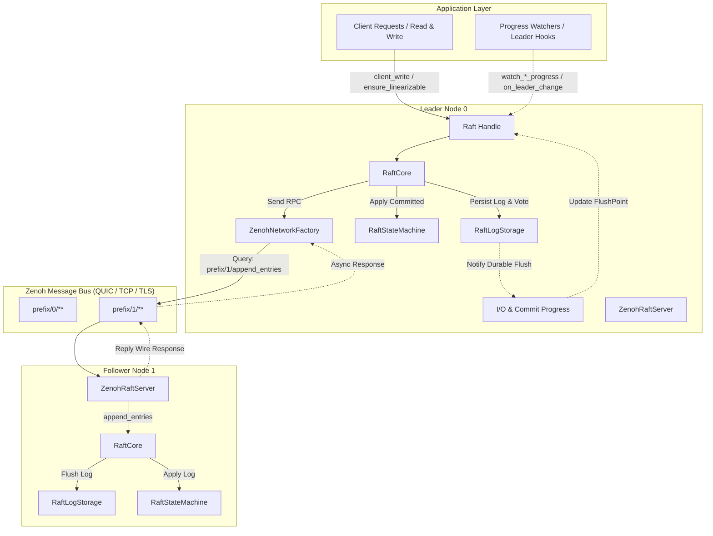

# zenoh_raft : Distributed Raft Consensus Engine Powered by Zenoh Transport

High-performance, async distributed consensus engine built on Rust Edition 2024, combining the Raft consensus protocol with [Zenoh](https://zenoh.io/) peer-to-peer and routed communication middleware.

## Project Overview

zenoh_raft delivers robust consensus capabilities with minimal communication overhead. By leveraging Zenoh queryable endpoints and key-expression routing, nodes discover peers and exchange Raft RPCs without dedicated network infrastructure or manual socket lifecycle management.

Key capabilities include:

- Distributed state machine replication with leader election and log management.
- Native Zenoh transport integration for RPC routing over QUIC (Plain / TLS), TCP, or TLS.
- Fine-grained I/O flush and execution progress tracking (Log, Vote, Commit, Snapshot, Applied).
- Linearizable reads supporting both ReadIndex and LeaseRead policies.
- Dynamic cluster membership reconfiguration using joint consensus.
- Pipeline log streaming and batched I/O execution.

## Key Features

- **Native Zenoh Transport**: Direct mapping of Raft RPCs (AppendEntries, RequestVote, InstallSnapshot, TransferLeader) to Zenoh query expressions, providing zero-configuration routing across edge, cloud, and mesh networks.
- **Native Multi-Transport Session Builder**: Integrated `ZenohSessionBuilder`, supporting UDP-based certificate-free QUIC Plain reliable multistream transport (`quic_plain`), native plain TCP transport (`tcp`), and QUIC TLS transport with custom security credentials (`quic_tls`) out of the box.
- **Multi-Dimensional Progress Tracking**: Non-blocking observation (`watch_*_progress`) and asynchronous threshold synchronization (`wait_until_ge`) for log I/O flushes (`FlushPoint`), vote persistence, quorum commits, snapshots, and state machine application.
- **Leader Lifecycle Hooks**: Cluster-wide `on_cluster_leader_change` and local node `on_leader_change` callbacks to coordinate async service startup and shutdown.
- **Efficient Binary Serialization**: Optimized wire format using `bitcode` encoding for low serialization latency and minimal network footprint.
- **Linearizable Consistency**: Strict data safety through Raft commit invariants, quorum lease validation, and state machine version tracking.
- **Joint Consensus Membership Changes**: Two-phase membership transition allowing safe cluster scaling without disruption.
- **Pluggable Storage Abstractions**: Modular separation between log storage (`RaftLogStorage`) and state machine execution (`RaftStateMachine`).
- **Asynchronous Execution Architecture**: Non-blocking concurrency runtime powered by asynchronous channels and decoupled worker routines.

## Usage

The following example demonstrates creating a 3-node cluster over Zenoh transport, initializing membership, writing data via leader, and executing linearizable reads:

```rust
use std::sync::Arc;
use std::time::Duration;
use maplit::btreeset;
use zenoh::query::QueryTarget;
use zenoh_raft::{
  Config, Raft, ReadPolicy, ServerState,
  ZenohNetworkConfig, ZenohNetworkFactory, ZenohRaftServer, ZenohSessionBuilder,
  testing::memstore::{ClientRequest, IntoMemClientRequest, TypeConfig, new_mem_store},
};

#[compio::main]
async fn main() -> Result<(), Box<dyn std::error::Error>> {
  let key_prefix = "demo_raft_cluster";

  // 1. Initialize Zenoh session (using QUIC Plain transport)
  let session = Arc::new(
    ZenohSessionBuilder::new()
      .quic_plain("127.0.0.1:7447", true)
      .open()
      .await?,
  );

  // 2. Configure Raft parameters
  let raft_config = Arc::new(
    Config {
      enable_heartbeat: true,
      heartbeat_interval: 100,
      election_timeout_min: 500,
      election_timeout_max: 600,
      ..Default::default()
    }
    .validate()?,
  );

  let net_config = ZenohNetworkConfig {
    key_prefix: key_prefix.to_string(),
    default_timeout: Duration::from_secs(3),
    query_target: QueryTarget::BestMatching,
  };

  // 3. Create 3 Raft nodes with in-memory store and Zenoh network factory
  let (sto0, sm0) = new_mem_store();
  let net0 = ZenohNetworkFactory::<TypeConfig>::new(session.clone(), net_config.clone());
  let raft0 = Raft::new(0, raft_config.clone(), net0, sto0, sm0.clone()).await?;

  let (sto1, sm1) = new_mem_store();
  let net1 = ZenohNetworkFactory::<TypeConfig>::new(session.clone(), net_config.clone());
  let raft1 = Raft::new(1, raft_config.clone(), net1, sto1, sm1.clone()).await?;

  let (sto2, sm2) = new_mem_store();
  let net2 = ZenohNetworkFactory::<TypeConfig>::new(session.clone(), net_config.clone());
  let raft2 = Raft::new(2, raft_config.clone(), net2, sto2, sm2.clone()).await?;

  // 4. Start Zenoh RPC queryable servers on each node
  let _srv0 = ZenohRaftServer::start(&session, raft0.clone(), key_prefix, 0).await?;
  let _srv1 = ZenohRaftServer::start(&session, raft1.clone(), key_prefix, 1).await?;
  let _srv2 = ZenohRaftServer::start(&session, raft2.clone(), key_prefix, 2).await?;

  // 5. Initialize cluster from node 0 and form 3-node membership
  raft0.initialize(btreeset! {0}).await?;
  raft0
    .wait(Some(Duration::from_secs(5)))
    .state(ServerState::Leader, "node 0 becomes leader")
    .await?;

  raft0.add_learner(1, (), true).await?;
  raft0.add_learner(2, (), true).await?;
  raft0.change_membership(btreeset! {0, 1, 2}, false).await?;

  // 6. Execute client writes through the leader
  let write_resp = raft0
    .client_write(ClientRequest::make_request("account_1", 100))
    .await?;
  println!("Log index applied: {:?}", write_resp.log_id);

  // 7. Perform linearizable read validation
  raft0.ensure_linearizable(ReadPolicy::ReadIndex).await?;
  let sm_state = sm0.get_state_machine().await;
  println!("Applied client state: {:?}", sm_state.client_status.get("account_1"));

  Ok(())
}
```

## Design & Architecture

zenoh_raft decouples consensus logic, state persistence, network transport, and progress observation into clear layers:

- **Raft Handle (`Raft<C, SM>`)**: Lightweight, cheaply cloneable frontend handle exposing client operations, administrative triggers, progress watch channels, and protocol handlers.
- **Raft Core (`RaftCore`)**: Singleton state machine actor executing the Raft protocol loop, election timers, quorum calculations, and replication progress trackers.
- **Storage Subsystem**: Split into `RaftLogStorage` (persisting votes and append logs) and `RaftStateMachine` (applying committed entries and managing snapshots).
- **Zenoh Transport Layer**: Translates outgoing RPCs into Zenoh `get()` queries and incoming queries into Raft method executions via `ZenohRaftServer`.
- **Progress Tracking Channels**: Dedicated asynchronous pipelines capturing durable storage flushes (`FlushPoint`), quorum commit advances, and state machine transitions.



## Tech Stack

- **Rust Edition 2024**: Modern Rust language standard with strict safety and zero-cost abstractions.
- **Zenoh 1.10**: Universal publish/subscribe, queryable, and routing middleware.
- **Bitcode**: Zero-overhead binary encoding for wire format structures.
- **Compio & Crossfire**: Asynchronous I/O execution, timers, and lock-free channels.
- **Rapidhash**: High-speed hashing implementation for internal map lookups.
- **Jiff & Coarsetime**: High-resolution and low-overhead timestamp tracking.
- **Sonic-rs**: Blazing fast JSON5 / JSON serialization.

## Directory Structure

```
raft/
├── Cargo.toml                  # Package manifest and dependency configuration
├── README.mdt                  # Documentation template
├── readme/                     # Bilingual documentation sources
│   ├── en.md                   # English documentation
│   └── zh.md                   # Chinese documentation
├── src/                        # Core library source code
│   ├── async_runtime/          # Async runtime abstraction, deterministic RNG, watch channels
│   ├── base/                   # Base trait bounds, features, and ID generator
│   ├── batch/                  # Batch abstraction and inline batch buffers
│   ├── change_members.rs       # Cluster membership modification commands
│   ├── config/                 # Raft configuration, runtime adjustments, validation rules
│   ├── core/                   # RaftCore state loop, heartbeat worker, linearizable read queue
│   │   ├── heartbeat/          # Heartbeat interval timer & exception handling
│   │   ├── io_flush_tracking/  # Durable storage FlushPoint progress tracking
│   │   └── linearizable_read/  # Linearizable read queue and ReadIndex logic
│   ├── display_ext/            # Formatting and string representation extensions
│   ├── engine/                 # Pure consensus state transition engine
│   │   └── handler/            # Election, leader, replication, log, and snapshot handlers
│   ├── entry/                  # Log entry representations and payload abstractions
│   ├── errors/                 # Error types for RPC, storage, replication, and client APIs
│   ├── extensions.rs           # Extensible typed context map for Raft instances
│   ├── impls/                  # Default trait implementations (Node, LeaderId, Responders)
│   ├── log_id/                 # Raft LogId structure and comparison traits
│   ├── log_id_range.rs         # Bounded LogId ranges for batch replication
│   ├── membership/             # Joint consensus membership calculations and storage
│   ├── metrics/                # Node state metrics, data metrics, and condition waiters
│   ├── network/                # Raft network traits, Zenoh network factory, and Zenoh server
│   │   └── zenoh/              # Zenoh session builder, TLS config, and RPC wire codec
│   ├── node.rs                 # Node ID and Node address definitions
│   ├── progress/               # Follower replication progress tracking
│   ├── proposer/               # Leader proposal management
│   ├── quorum/                 # Majority quorum and joint quorum calculation
│   ├── raft/                   # Main Raft handle, AppApi, ManagementApi, ProtocolApi
│   │   ├── api/                # Separated application, management, and protocol APIs
│   │   ├── linearizable_read/  # Linearizable reader implementation
│   │   ├── message/            # Client write request and control message definitions
│   │   ├── responder/          # Response channels and progress notifiers
│   │   └── watch_handle.rs     # Async watch handle (WatchChangeHandle)
│   ├── raft_state/             # Internal Raft state tracking and membership state
│   ├── raft_types.rs           # Term, Index, and Snapshot ID type aliases
│   ├── replication/            # Background replication worker loops and snapshot transmitter
│   ├── runtime/                # Runtime execution hooks
│   ├── storage/                # RaftLogStorage, RaftStateMachine, and snapshot builder traits
│   ├── summary.rs              # Message summary formatting traits
│   ├── testing/                # In-memory test store, mock fixtures, and utilities
│   ├── try_as_ref.rs           # Reference extraction helper traits
│   ├── type_config/            # RaftTypeConfig trait and type definitions
│   ├── utime.rs                # Timestamp and elapsed duration tracking
│   ├── vote/                   # Vote and LeaderId state structures
│   └── lib.rs                  # Crate root and public export surface
└── tests/                      # Integration and scenario test suite
    ├── append_entries_test.rs  # Log append and conflict handling tests
    ├── client_api_test.rs      # Client write and read API tests
    ├── elect_test.rs           # Leader election tests
    ├── extensions_test.rs      # Context extension injection and retrieval tests
    ├── fixtures/               # Test harness fixtures and RPC mocks
    ├── life_cycle_test.rs      # Node startup and graceful shutdown tests
    ├── log_store_test.rs       # Log storage contract tests
    ├── management_test.rs      # Manual election and snapshot trigger tests
    ├── membership_test.rs      # Joint consensus and membership transition tests
    ├── metrics_test.rs         # Metrics assertions and progress watchers (Log/Vote/Snapshot)
    ├── replication_test.rs     # Replication stream and multi-replica synchronization tests
    ├── snapshot_test.rs        # Snapshot building, transmission, and restoration tests
    ├── state_machine_test.rs   # State machine application and consistency tests
    ├── zenoh_cluster_test.rs   # Real Zenoh QUIC Plain/TLS cluster integration tests
    └── zenoh_test.rs           # Zenoh session connectivity and queryable tests
```

## API Reference

### Core Types & Handles

- `Raft<C, SM>`: Primary handle to interact with a Raft node. Cheaply cloneable. Key methods:
  - `new(id, config, network, log_store, state_machine)`: Constructs and spawns a Raft node instance.
  - `initialize(members)`: Bootstraps initial cluster membership on a pristine node.
  - `client_write(app_data)`: Submits a state mutation command through the leader.
  - `client_write_many(app_data)`: Streams multiple mutation commands in a single batch.
  - `write(app_data)`: Returns a builder (`WriteRequest`) for flexible write dispatch (custom `responder` or leader condition `with_leader`).
  - `ensure_linearizable(policy)`: Verifies leadership and returns the required read log boundary for linearizable reads.
  - `get_read_linearizer(policy)`: Returns a `Linearizer` for fine-grained read synchronization.
  - `add_learner(id, node, blocking)`: Adds a learner node and establishes log replication.
  - `change_membership(members, retain)`: Proposes a dynamic membership change via joint consensus.
  - `vote(rpc)` / `pre_vote(rpc)`: Handles vote requests from candidate nodes.
  - `append_entries(rpc)` / `stream_append(stream)`: Processes log replication requests.
  - `install_full_snapshot(vote, snapshot)`: Applies a complete snapshot to the state machine.
  - `handle_transfer_leader(req)`: Executes graceful leadership transfer.
  - `shutdown()`: Triggers graceful node termination.
  - `trigger()`: Provides administrative hooks (manual election, snapshot builds, log purges).
  - `runtime_config()`: Dynamically toggles election, heartbeat, and tick execution.
  - `as_leader()`: Validates whether the local node is currently the active leader.
  - `is_leader()`: Fast boolean check of current leadership status.
  - `node_id()` / `voter_ids()` / `learner_ids()`: Queries node identification and membership sets.
  - `app_api()` / `management_api()` / `protocol_api()`: Provides stratified interfaces for application commands, management tasks, and raw protocol RPCs.
  - `with_raft_state(func)` / `with_state_machine(func)`: Safely inspects internal state within execution contexts.
  - `extensions()` / `extension::<T>()`: Accesses and retrieves injected context extensions.

### Progress Tracking & Event Observation

- `watch_log_progress()`: Obtains a log I/O flush progress watcher (`LogProgress`), tracking log entries and votes durably written to storage:
  - `get()`: Returns current flush boundary `Option<FlushPoint>`.
  - `wait_until_ge(&target)`: Asynchronously waits until durable flush progress reaches or exceeds the target.
- `watch_vote_progress()`: Obtains a vote I/O progress watcher (`VoteProgress`), updated whenever leadership/vote state is persisted.
- `watch_commit_progress()`: Obtains a quorum commit progress watcher (`CommitProgress`), tracking committed log index advancements.
- `watch_snapshot_progress()`: Obtains a snapshot progress watcher (`SnapshotProgress`), tracking snapshot creation and installation.
- `watch_apply_progress()`: Obtains an applied log progress watcher (`AppliedProgress`), tracking log entry application onto the state machine.
- `on_cluster_leader_change(callback)`: Registers a callback invoked on every cluster-wide leader transition, returning a cancellable `WatchChangeHandle`.
- `on_leader_change(start, stop)`: Registers callbacks for local node election and resignation, guaranteeing strictly alternating `start`/`stop` execution.
- `FlushPoint`: Durable storage progress boundary, encapsulating persisted `Vote` and latest log identity `Option<LogId>`.

### Metrics & Condition Waiters

- `metrics()`: Obtains a watch receiver for overall node runtime metrics (`RaftMetrics`).
- `data_metrics()`: Obtains a watch receiver for log and storage metrics (`RaftDataMetrics`).
- `server_metrics()`: Obtains a watch receiver for node roles and voting metrics (`RaftServerMetrics`).
- `wait(timeout)`: Constructs a fluent condition waiter (`Wait`), supporting:
  - `state(server_state, desc)`: Waits until node enters target state.
  - `current_leader(leader_id, desc)`: Waits until current leader becomes the target node.
  - `leader_with_quorum_acked(at_least, desc)`: Waits until leader quorum ack timestamp reaches the threshold.
  - `log_index(index, desc)`: Waits until log index reaches target.
  - `applied_index(index, desc)`: Waits until state machine applied index reaches target.
  - `vote(vote, desc)`: Waits until voting state advances.
  - `members(members, desc)`: Waits until cluster membership transition completes.
  - `purged(log_id, desc)`: Waits until log purging advances to target boundary.

### Zenoh Network Integration

- `ZenohSessionBuilder`: Fluent builder optimized for QUIC Plain, TCP, and QUIC TLS session establishment:
  - `quic_plain(endpoint, is_listener)`: Configures native certificate-free QUIC Plain endpoint (based on UDP + `rel=1` reliable stream + `multistream=1` multiplexing, zero certificates and zero keys required).
  - `udp_reliable(endpoint, is_listener)`: Compatibility alias for `quic_plain`.
  - `tcp(endpoint, is_listener)`: Configures plain TCP endpoint (no TLS handshake overhead).
  - `quic_tls(endpoint, is_listener, tls)`: Configures QUIC TLS endpoint with user-specified credentials.
  - `udp(endpoint, is_listener)`: Adds plain best-effort (unreliable) UDP endpoint.
  - `endpoint(endpoint, is_listener)`: Adds general Locator endpoint.
  - `tls(tls_config)`: Configures TLS certificate parameters.
  - `build_config()`: Builds `zenoh::Config`.
  - `open()`: Asynchronously creates and opens the `zenoh::Session`.
- `ZenohTlsConfig`: TLS certificate configuration (only used on-demand when `quic_tls` is enabled):
  - `from_pem(cert, key, root_ca, verify_name)`: Loads credentials from PEM strings.
  - `new(cert_b64, key_b64, root_ca_b64, verify_name)`: Loads credentials from Base64 strings.
- `ZenohNetworkConfig`: Network configuration options (prefix `key_prefix`, timeout `default_timeout`, routing `query_target`).
- `ZenohNetworkFactory<C>`: Factory implementing `RaftNetworkFactory<C>` using a shared `zenoh::Session`.
- `ZenohNetwork<C>`: Network client instance handling RPC dispatches to a specific target node over Zenoh queries.
- `ZenohRaftServer`: Queryable listener registering key expressions (`<key_prefix>/<node_id>/**`) and dispatching incoming requests directly into the local Raft node.

### Configuration & Protocols

- `Config`: Raft protocol parameters (election timeouts, heartbeat intervals, batch sizes, snapshot policies, replication lag thresholds).
- `ServerState`: Node operational state (`Leader`, `Follower`, `Candidate`, `Learner`).
- `ReadPolicy`: Read consistency mode (`ReadIndex` for quorum heartbeat validation, `LeaseRead` for local lease validation).
- `ChangeMembers`: Specification for membership adjustments (`AddNodes`, `RemoveNodes`, `Replace`, `PurgeNodes`).
- `Precondition`: Guard conditions for atomic membership transitions (`LastMembershipLogId`, `CommittedLeaderId`).
- `SnapshotPolicy`: Snapshot strategy (`Never`, `LogsSinceLast(u64)`).

### Storage Traits & Data Types

- `RaftLogStorage<C>`: Trait for persistent log storage, log truncation, vote persistence, and committed index recording.
- `RaftStateMachine<C>`: Trait for applying committed log entries, building snapshots, and restoring state from snapshots.
- `RaftLogReader<C>`: Interface for reading log entries and state metadata.
- `RaftSnapshotBuilder<C>`: Interface for generating point-in-time state snapshots.
- `LogId<N>`: Unique log entry identifier containing term and log index.
- `Vote<N>`: Leader election vote state containing term and node identity.
- `Entry<C>` / `EntryPayload<C>`: Log entry container holding normal commands, membership configs, or blank entries.
- `Snapshot<C>` / `SnapshotMeta<C>`: Complete snapshot package with metadata and readable data cursor.

### Type Configuration

- `RaftTypeConfig`: Trait defining associated types for application data (`D`), response (`R`), node ID (`NodeId`), node metadata (`Node`), term (`Term`), leader ID (`LeaderId`), vote (`Vote`), payload (`Payload`), entry (`Entry`), and async responder (`Responder`).
- `declare_raft_types!`: Macro generating concrete implementations of `RaftTypeConfig` with sensible defaults.
