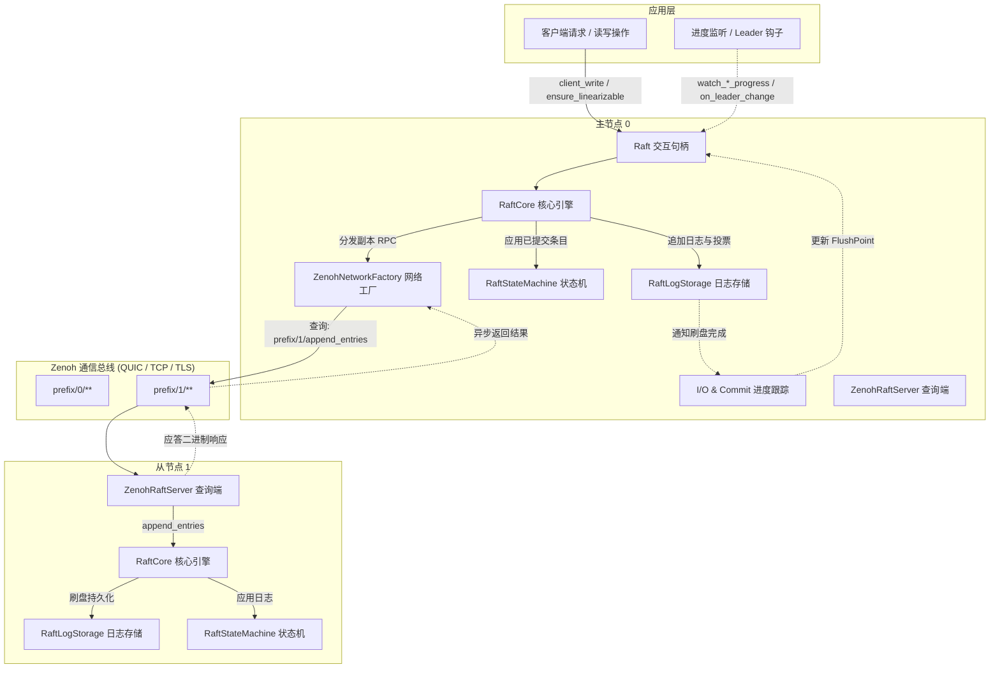

# zenoh_raft : 基于 Zenoh 传输层的高性能分布式 Raft 共识引擎

基于 Rust Edition 2024 构建的异步分布式共识引擎，深度结合 Raft 共识协议与 [Zenoh](https://zenoh.io/) 点对点及路由通信中间件。

## 项目功能介绍

zenoh_raft 提供高吞吐、低延迟的分布式一致性保障。通过 Zenoh 表达力丰富的 Key 表达式路由与 Queryable 查询机制，节点间可直接完成对等发现与 Raft RPC 通信，无需额外部署独立网络代理或手动维护套接字连接生命周期。

核心能力包含：

- 分布式状态机复制、主节点选举与日志生命周期管理。
- 原生集成 Zenoh 传输层，无缝支持 QUIC（Plain / TLS）、TCP、TLS 等多种底层网络协议。
- 细粒度 I/O 刷盘与应用进度监听（日志、投票、提交、快照、应用）。
- 线性一致性读保障，提供 ReadIndex 与 LeaseRead 两种一致性读策略。
- 基于联合共识（Joint Consensus）的动态集群成员变更。
- 流式日志复制与异步流水线批处理。

## 特性介绍

- **原生 Zenoh 传输**：将 Raft 核心 RPC（AppendEntries、RequestVote、InstallSnapshot、TransferLeader）直接映射至 Zenoh 键表达式查询，在边缘计算、跨网段及网状拓扑中实现零配置通信。
- **QUIC 会话构造器**：内置 `ZenohSessionBuilder` 与 `ZenohTlsConfig`，支持自签名证书自动化配置（`quic_plain`）与自定义安全证书凭据（`quic_tls`），开箱即用。
- **多维进度跟踪体系**：提供对日志刷盘（`FlushPoint`）、投票持久化、法定人数提交、快照构建及状态机应用的非阻塞监听（`watch_*_progress`）与异步等待（`wait_until_ge`）。
- **领导者生命周期监听**：提供集群级 `on_cluster_leader_change` 与本地节点 `on_leader_change` 钩子，支持优雅的异步服务启动与停止。
- **高效二进制编码**：采用 `bitcode` 高性能编解码器序列化传输载荷，大幅降低序列化开销与网络带宽占用。
- **线性一致性保证**：严格遵循 Raft 提交不变式、法定人数租约校验与状态机应用水位跟踪，杜绝脏读。
- **联合共识成员变更**：采用两阶段配置变更方案，支持平滑动态扩缩容，避免集群脑裂。
- **解耦存储抽象**：解耦持久化日志存储接口（`RaftLogStorage`）与状态机接口（`RaftStateMachine`），便于对接 RocksDB、内存存储或自定义持久化引擎。
- **纯异步执行架构**：基于异步通道与独立 Worker 调度，消除阻塞等待，提升并发处理能力。

## 使用演示

以下示例展示创建 3 节点集群、配置 Zenoh 传输、初始化集群拓扑、提交数据写入并执行线性一致性读取的完整流程：

```rust
use std::sync::Arc;
use std::time::Duration;
use maplit::btreeset;
use zenoh::query::QueryTarget;
use zenoh_raft::{
  Config, Raft, ReadPolicy, ServerState,
  ZenohNetworkConfig, ZenohNetworkFactory, ZenohRaftServer, ZenohSessionBuilder,
  testing::memstore::{ClientRequest, IntoMemClientRequest, TypeConfig, new_mem_store},
};

#[compio::main]
async fn main() -> Result<(), Box<dyn std::error::Error>> {
  let key_prefix = "demo_raft_cluster";

  // 1. 创建 Zenoh 会话（基于 QUIC Plain 传输）
  let session = Arc::new(
    ZenohSessionBuilder::new()
      .quic_plain("127.0.0.1:7447", true)
      .open()
      .await?,
  );

  // 2. 配置 Raft 参数
  let raft_config = Arc::new(
    Config {
      enable_heartbeat: true,
      heartbeat_interval: 100,
      election_timeout_min: 500,
      election_timeout_max: 600,
      ..Default::default()
    }
    .validate()?,
  );

  let net_config = ZenohNetworkConfig {
    key_prefix: key_prefix.to_string(),
    default_timeout: Duration::from_secs(3),
    query_target: QueryTarget::BestMatching,
  };

  // 3. 创建 3 节点内存存储与 Zenoh 网络工厂
  let (sto0, sm0) = new_mem_store();
  let net0 = ZenohNetworkFactory::<TypeConfig>::new(session.clone(), net_config.clone());
  let raft0 = Raft::new(0, raft_config.clone(), net0, sto0, sm0.clone()).await?;

  let (sto1, sm1) = new_mem_store();
  let net1 = ZenohNetworkFactory::<TypeConfig>::new(session.clone(), net_config.clone());
  let raft1 = Raft::new(1, raft_config.clone(), net1, sto1, sm1.clone()).await?;

  let (sto2, sm2) = new_mem_store();
  let net2 = ZenohNetworkFactory::<TypeConfig>::new(session.clone(), net_config.clone());
  let raft2 = Raft::new(2, raft_config.clone(), net2, sto2, sm2.clone()).await?;

  // 4. 在各节点注册 Zenoh Raft RPC Queryable 服务端
  let _srv0 = ZenohRaftServer::start(&session, raft0.clone(), key_prefix, 0).await?;
  let _srv1 = ZenohRaftServer::start(&session, raft1.clone(), key_prefix, 1).await?;
  let _srv2 = ZenohRaftServer::start(&session, raft2.clone(), key_prefix, 2).await?;

  // 5. 初始化单节点并扩展为 3 节点集群
  raft0.initialize(btreeset! {0}).await?;
  raft0
    .wait(Some(Duration::from_secs(5)))
    .state(ServerState::Leader, "node 0 becomes leader")
    .await?;

  raft0.add_learner(1, (), true).await?;
  raft0.add_learner(2, (), true).await?;
  raft0.change_membership(btreeset! {0, 1, 2}, false).await?;

  // 6. 主节点提交客户端写请求
  let write_resp = raft0
    .client_write(ClientRequest::make_request("account_1", 100))
    .await?;
  println!("日志已提交并应用至索引: {:?}", write_resp.log_id);

  // 7. 线性一致性读验证
  raft0.ensure_linearizable(ReadPolicy::ReadIndex).await?;
  let sm_state = sm0.get_state_machine().await;
  println!("状态机客户端数据: {:?}", sm_state.client_status.get("account_1"));

  Ok(())
}
```

## 设计思路

zenoh_raft 将共识算法逻辑、持久化层、网络传输层与进度跟踪解耦为清晰模块：

- **Raft 句柄 (`Raft<C, SM>`)**：轻量级、低开销可克隆的前端交互接口，负责向应用层暴露写操作、一致性读、成员管理、进度监听通道与管理触发器。
- **Raft 核心状态机 (`RaftCore`)**：单例核心调度实体，运行 Raft 事件驱动主循环，维护选举计时器、心跳分发、法定人数仲裁及副本复制进度。
- **存储子系统**：严格拆分为 `RaftLogStorage`（负责持久化投票状态与日志追加）与 `RaftStateMachine`（负责顺序应用已提交日志并生成/安装快照）。
- **Zenoh 网络层**：将出站 RPC 封装为 Zenoh `get()` 查询，通过 `ZenohRaftServer` 监听特定键表达式并将入站请求分发给本地 Raft 实例。
- **进度监控体系**：维护多维度的异步通知管道，精确捕获存储持久化（`FlushPoint`）、法定人数提交水位及状态机日志应用的每一阶段状态跃迁。



## 技术堆栈

- **Rust Edition 2024**：采用现代 Rust 语法特性与严谨类型系统。
- **Zenoh 1.10**：兼具发布订阅、分布式查询与路由能力的现代通信协议。
- **Bitcode**：高性能紧凑二进制序列化格式。
- **Compio & Crossfire**：高性能异步运行时与高效无锁通道。
- **Rapidhash**：快速哈希表实现。
- **Jiff & Coarsetime**：高精度与低开销时间计算方案。
- **Sonic-rs**：极速 JSON5 / JSON 序列化。

## 目录结构

```
raft/
├── Cargo.toml                  # 项目依赖与包配置清单
├── README.mdt                  # 文档组合模板文件
├── readme/                     # 双语详细文档目录
│   ├── en.md                   # 英文说明文档
│   └── zh.md                   # 中文说明文档
├── src/                        # 核心源代码目录
│   ├── async_runtime/          # 异步运行时抽象、确定性随机数与 watch 广播通道
│   ├── base/                   # 基础 Trait 约束与 ID 生成器
│   ├── batch/                  # 批处理抽象与内联批处理缓冲区
│   ├── change_members.rs       # 集群拓扑成员变更指令集
│   ├── config/                 # Raft 参数配置、运行时动态调节与配置校验
│   ├── core/                   # RaftCore 状态机循环、心跳管理与线性一致性读队列
│   │   ├── heartbeat/          # 心跳间隔控制与心跳异常处理
│   │   ├── io_flush_tracking/  # 存储持久化 FlushPoint 水位追踪
│   │   └── linearizable_read/  # 线性一致性读队列与 ReadIndex 逻辑
│   ├── display_ext/            # 格式化输出与字符串表示扩展
│   ├── engine/                 # 纯函数式共识状态转移引擎
│   │   └── handler/            # 选举、选主、复制、日志与快照处理器
│   ├── entry/                  # 日志条目结构与载荷定义
│   ├── errors/                 # 细粒度错误类型定义（RPC、存储、复制与客户端调用）
│   ├── extensions.rs           # Raft 实例上下文扩展存储容器
│   ├── impls/                  # 默认 Trait 实现（节点定义、LeaderId、响应通道）
│   ├── log_id/                 # 日志 LogId 标识与比较逻辑
│   ├── log_id_range.rs         # 范围日志 LogId 区间与批处理划分
│   ├── membership/             # 联合共识成员计算与持久化模型
│   ├── metrics/                # 节点运行指标采集与状态等待器
│   ├── network/                # Raft 网络 Trait、Zenoh 客户端工厂与服务端实现
│   │   └── zenoh/              # Zenoh 会话构造器、TLS 配置与 RPC 编解码
│   ├── node.rs                 # 节点 ID 与节点网络元数据定义
│   ├── progress/               # 副本节点日志同步进度跟踪器
│   ├── proposer/               # 提议者状态机与提案管理
│   ├── quorum/                 # 多数派与联合法定人数计算
│   ├── raft/                   # Raft 主句柄、AppApi、ManagementApi、ProtocolApi
│   │   ├── api/                # 分离的应用 API、管理 API 与协议内部 API
│   │   ├── linearizable_read/  # 线性一致性读取器实现
│   │   ├── message/            # 客户端写请求与控制消息定义
│   │   ├── responder/          # 响应通道与进度通知器
│   │   └── watch_handle.rs     # 异步监听句柄（WatchChangeHandle）
│   ├── raft_state/             # 内部状态管理与成员配置快照
│   ├── raft_types.rs           # 任期 Term、索引 Index 及快照 ID 类型别名
│   ├── replication/            # 后台日志复制 Worker 调度与快照传输
│   ├── runtime/                # 运行时钩子与执行辅助
│   ├── storage/                # RaftLogStorage、RaftStateMachine 及快照构建 Trait
│   ├── summary.rs              # 协议消息摘要输出 Trait
│   ├── testing/                # 内存存储测试套件与模拟环境
│   ├── try_as_ref.rs           # 引用提取辅助 Trait
│   ├── type_config/            # RaftTypeConfig 类型配置定义与关联类型绑定
│   ├── utime.rs                # 微秒/纳秒单调时间跟踪
│   ├── vote/                   # 投票状态与 LeaderId 结构体
│   └── lib.rs                  # Crate 根模块与顶层公共导出接口
└── tests/                      # 集成测试与场景验证套件
    ├── append_entries_test.rs  # 日志追加与冲突处理测试
    ├── client_api_test.rs      # 客户端读写 API 测试
    ├── elect_test.rs           # 选主与任期切换测试
    ├── extensions_test.rs      # 扩展上下文注入与读取测试
    ├── fixtures/               # 测试固件与网络 Mock
    ├── life_cycle_test.rs      # 节点生命周期启动与停止测试
    ├── log_store_test.rs       # 日志存储引擎接口契约测试
    ├── management_test.rs      # 手动选举与快照触发管理测试
    ├── membership_test.rs      # 联合共识与成员变更测试
    ├── metrics_test.rs         # 监控指标与进度监听器（Log/Vote/Snapshot Progress）测试
    ├── replication_test.rs     # 日志复制流与多副本同步测试
    ├── snapshot_test.rs        # 快照构建、传输与恢复测试
    ├── state_machine_test.rs   # 状态机应用与一致性测试
    ├── zenoh_cluster_test.rs   # 真实 Zenoh QUIC Plain/TLS 传输层集群集成测试
    └── zenoh_test.rs           # Zenoh 会话通信与 Queryable 响应测试
```

## API 说明

### 核心类型与句柄

- `Raft<C, SM>`：Raft 节点主交互句柄，支持轻量克隆。主要方法：
  - `new(id, config, network, log_store, state_machine)`：构建并启动 Raft 节点实例。
  - `initialize(members)`：在全新节点上初始化初始集群成员配置。
  - `client_write(app_data)`：通过 Leader 节点提交数据修改请求。
  - `client_write_many(app_data)`：以流式批处理方式提交多条写请求。
  - `write(app_data)`：提供流式写请求构造器（`WriteRequest`），支持自定义响应器（`responder`）与 Leader 条件校验（`with_leader`）。
  - `ensure_linearizable(policy)`：校验 Leader 身份并返回一致性读取所需日志水位。
  - `get_read_linearizer(policy)`：获取 `Linearizer`，精细化控制读取就绪等待。
  - `add_learner(id, node, blocking)`：向集群添加 Learner 节点并建立副本同步。
  - `change_membership(members, retain)`：提交联合共识成员变更提议。
  - `vote(rpc)` / `pre_vote(rpc)`：处理候选节点发起的拉票与预拉票 RPC。
  - `append_entries(rpc)` / `stream_append(stream)`：处理日志复制与心跳 RPC。
  - `install_full_snapshot(vote, snapshot)`：向状态机安装全量快照。
  - `handle_transfer_leader(req)`：处理优雅 Leader 转移。
  - `shutdown()`：优雅停止 Raft 节点。
  - `trigger()`：获取管理触发器（手动发起选举、快照构建、日志清理）。
  - `runtime_config()`：运行时动态调整选举、心跳及时钟轮询开关。
  - `as_leader()`：确认本地是否处于已提交 Leader 状态。
  - `is_leader()`：快速判断当前节点是否为主节点。
  - `node_id()` / `voter_ids()` / `learner_ids()`：获取节点编号与当前成员集合。
  - `app_api()` / `management_api()` / `protocol_api()`：获取分层的应用层、管理层与底层 RPC 协议交互接口。
  - `with_raft_state(func)` / `with_state_machine(func)`：在安全执行上下文直接访问内部状态。
  - `extensions()` / `extension::<T>()`：访问与检索注入的上下文扩展。

### 进度跟踪与事件监听

- `watch_log_progress()`：获取日志 I/O 刷盘进度监听器（`LogProgress`），追踪日志与投票持久化到存储的状态：
  - `get()`：读取当前持久化水位 `Option<FlushPoint>`。
  - `wait_until_ge(&target)`：异步等待持久化水位达到或超过指定目标。
- `watch_vote_progress()`：获取投票 I/O 进度监听器（`VoteProgress`），仅在 Leader 或 Term 变更持久化时触发更新。
- `watch_commit_progress()`：获取法定人数提交进度监听器（`CommitProgress`），追踪集群已提交日志推进。
- `watch_snapshot_progress()`：获取快照持久化进度监听器（`SnapshotProgress`），追踪快照构建或安装完成。
- `watch_apply_progress()`：获取状态机应用进度监听器（`AppliedProgress`），追踪日志条目应用至状态机的水位。
- `on_cluster_leader_change(callback)`：监听集群范围内的所有 Leader 变更，返回可主动关闭的 `WatchChangeHandle`。
- `on_leader_change(start, stop)`：监听本地节点当选或卸任 Leader 事件，确保 `start` 与 `stop` 回调严格交替执行。
- `FlushPoint`：I/O 刷盘点水位标尺，包含持久化投票 `Vote` 与最新日志标识 `Option<LogId>`。

### 监控指标与等待器

- `metrics()`：订阅全局节点运行指标 Watch 广播（`RaftMetrics`）。
- `data_metrics()`：订阅数据日志指标 Watch 广播（`RaftDataMetrics`）。
- `server_metrics()`：订阅节点角色与状态指标 Watch 广播（`RaftServerMetrics`）。
- `wait(timeout)`：创建指标条件等待器（`Wait`），支持链式等待：
  - `state(server_state, desc)`：等待节点切换至指定角色。
  - `current_leader(leader_id, desc)`：等待当前 Leader 切换为指定节点。
  - `leader_with_quorum_acked(at_least, desc)`：等待 Leader 多数派心跳确认时间达到指定时间戳。
  - `log_index(index, desc)`：等待日志索引达到目标值。
  - `applied_index(index, desc)`：等待状态机应用达到目标值。
  - `vote(vote, desc)`：等待节点投票状态变更。
  - `members(members, desc)`：等待集群成员变更生效。
  - `purged(log_id, desc)`：等待日志清理推进至指定水位。

### Zenoh 网络与会话模块

- `ZenohSessionBuilder`：针对 QUIC Plain 与 QUIC TLS 优化的流式会话构造器：
  - `quic_plain(endpoint, is_listener)`：配置 QUIC Plain 端点（自动生成自签名证书满足 QUIC 协议加密要求）。
  - `quic_tls(endpoint, is_listener, tls)`：配置带指定证书凭据的 QUIC TLS 端点。
  - `tls(tls_config)`：设置 TLS 证书配置。
  - `quic_endpoint(endpoint, is_listener)`：添加自定义 QUIC 端点。
  - `build_config()`：生成 `zenoh::Config`。
  - `open()`：异步打开并初始化 `zenoh::Session`。
- `ZenohTlsConfig`：TLS 证书凭据配置：
  - `self_signed()`：自动生成用于本地或内网测试的自签名证书。
  - `from_pem(cert, key, root_ca, verify_name)`：从 PEM 字符串加载证书与私钥。
  - `new(cert_b64, key_b64, root_ca_b64, verify_name)`：从 Base64 编码加载证书配置。
- `ZenohNetworkConfig`：Zenoh 网络参数配置（键前缀 `key_prefix`、超时时间 `default_timeout`、查询策略 `query_target`）。
- `ZenohNetworkFactory<C>`：基于共享 `zenoh::Session` 实现的 `RaftNetworkFactory<C>` 网络工厂。
- `ZenohNetwork<C>`：单节点 RPC 客户端，通过 Zenoh Query 发送 Raft RPC。
- `ZenohRaftServer`：Queryable 服务端监听器，监听 `<key_prefix>/<node_id>/**` 并路由至本地 Raft 实例。

### 配置与协议类型

- `Config`：Raft 核心运行参数（选举超时区间、心跳间隔、批处理上限、快照策略、落后阈值）。
- `ServerState`：节点角色枚举（`Leader`、`Follower`、`Candidate`、`Learner`）。
- `ReadPolicy`：线性一致性读策略（`ReadIndex` 法定人数心跳探测，`LeaseRead` 本地租约判定）。
- `ChangeMembers`：成员变更配置枚举（`AddNodes`、`RemoveNodes`、`Replace`、`PurgeNodes`）。
- `Precondition`：成员变更前置条件约束（`LastMembershipLogId`、`CommittedLeaderId`）。
- `SnapshotPolicy`：快照策略（`Never`、`LogsSinceLast(u64)`）。

### 存储接口与数据类型

- `RaftLogStorage<C>`：持久化日志存储 Trait，定义投票状态、日志追加、截断与提交索引更新逻辑。
- `RaftStateMachine<C>`：状态机 Trait，定义日志条目应用、快照构建与快照恢复逻辑。
- `RaftLogReader<C>`：日志读取接口，用于日志复制与回放。
- `RaftSnapshotBuilder<C>`：状态机快照构建接口。
- `LogId<N>`：全局唯一日志标识符，由 Term 和 Index 构成。
- `Vote<N>`：选举投票状态标识，包含 Term 与 Leader 标识。
- `Entry<C>` / `EntryPayload<C>`：日志条目与其载荷变体封装（常规应用数据、成员变更、空白条目）。
- `Snapshot<C>` / `SnapshotMeta<C>`：快照数据包及其元数据。

### 类型系统与宏

- `RaftTypeConfig`：全局类型配置 Trait，关联应用请求（`D`）、响应（`R`）、节点类型（`NodeId`/`Node`）、任期（`Term`）、Leader 类型（`LeaderId`）、投票（`Vote`）、载荷（`Payload`）、日志条目（`Entry`）以及响应通道（`Responder`）。
- `declare_raft_types!`：声明具体 `RaftTypeConfig` 实现的便利宏，支持未声明项回退至合理默认值。
